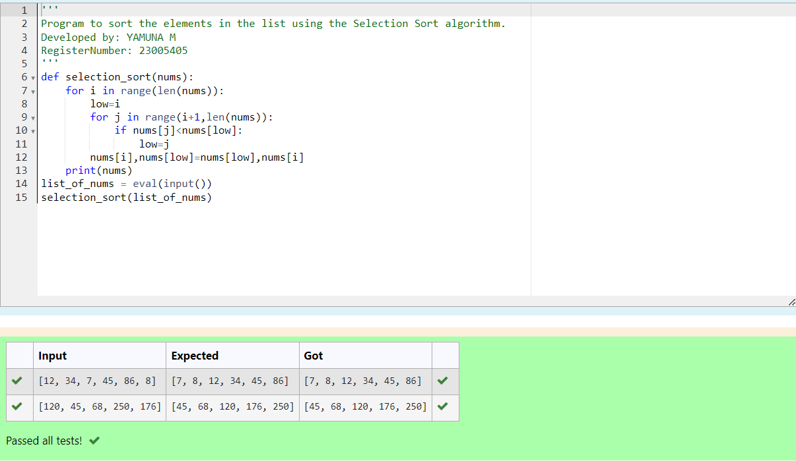

# Selection sort and Insertion sort
## Aim:
To write a program to perform selection sort and insertion sort using python programming.
## Equipment’s required:
1.	Hardware – PCs
2.	Anaconda – Python 3.7 Installation / Moodle-Code Runner
## Algorithm:
## Selection Sort Algorithm:
1.	Set the first unsorted element as the minimum
2.	For each of the unsorted elements, check if the element < current minimum.
3.	If yes, set the element as the new minimum.
4.	Swap minimum with first unsorted position.
5.	Repeat the steps 2 and 3 for all the elements in the array.
## Insertion Sort Algorithm:
1.	Set the first element as sorted element j.
2.	For each unsorted element X, check if current sorted element j >X.
3.	If yes, move sorted element to the right by 1.
4.	Break the loop and insert X.
5.	Repeat the steps 2 to 4 for sorting all the elements in the array.
## Program:
i)	#Selection Sort
```
''' 
Program to sort the elements in the list using the Selection Sort algorithm.
Developed by: YAMUNA M
RegisterNumber: 23005405
'''
def selection_sort(nums):
    for i in range(len(nums)):
        low=i
        for j in range(i+1,len(nums)):
            if nums[j]<nums[low]:
                low=j
        nums[i],nums[low]=nums[low],nums[i]
    print(nums)
list_of_nums = eval(input())
selection_sort(list_of_nums)


```
ii)	#Insertion Sort
```
''' 
Program to sort the elements in the list using the Insertion Sort algorithm.
Developed by: YAMUNA M
RegisterNumber: 23005405
'''
def insertion_sort(nums):
    for i in range(1,len(nums)):
        insert= nums[i]
        j=i-1
        while j>=0 and nums[j]>insert:
            nums[j+1]=nums[j]
            j-=1
        nums[j+1]=insert
    print(nums)


list_of_nums = eval(input())
insertion_sort(list_of_nums)


```

## Output:



## Result:
Thus the program is written to perform selection sort and insertion sort using python programming.
